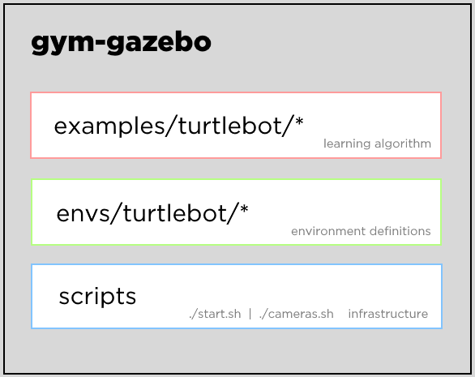

# System Overview

To create a reinforcment learning environment for multiple robots to play hide-and-seek in a reasonable timeframe, we needed to base our project off the most built-out infrastructure we could find. To this end, much of our system architecture is adopted from `erlerobot/gym-gazebo` which adapts the OpenAI Gym RL toolset for use with ROS and Gazebo.

## Goal

Our learning goals for this project were primarily to gain skill in using an ML framework with simulated robots in the Gazebo environment. As our project took shape, this meant figuring out how to best use the gym-gazebo codebase for our hide-and-seek sim. We were able to successfully work through a wide variety of deployment issues getting code in this repository even to run, isolate the pieces of code necessary for our hide-and-seek game, and begin training on a custom world with one "hider" and one "seeker".

Figuring out the steps to get started with this codebase was particularly time-consuming, so we also attempted to document as much of our setup procedure as we could, for folks in future classes interested in using the OpenAI gym on top of the robot environment they're made familiar with through CompRobo.

## Overall Architecture

Besides a slew of development technologies we used to create an environment within which we could test simulations, our architecture looks roughly like the following:

## Code Structure

While getting the dependencies lined up for running the code in this repository is quite non-trivial, the code structure is actually rather straightforward-- there are two files of interest we developed for our simulations:

- `gym-gazebo/gym_gazebo/envs/GazeboMazeMultiTurtlebot.py`
- `gym-gazebo/examples/turtlebot/maze_multi_turtlebot_qlearn.py`

The first of these files is responsible for defining the action spaces and step functions of robots in our simulation. Namely, we have two roles we've embedded into this file-- a "hider" and a "seeker". The file a step function that treats these roles separately, as during the "prep" phase the hider is active, else the seeker is.

The second file orchestrates the simulation and reinforcement learning process by independently managing Q-Learning algorithms for the hiders and seekers, running a for loop for 1000 steps in a learning episode, and dividing the steps between a preparatory "hiding" phase, and a "seeking" one. This, to the best of our knowledge, is configured to closely mirror the OpenAI hide-and-seek simulations available [here](https://openai.com/blog/emergent-tool-use/).

## Algorithms

We leverage a reinforcement learning approach using a Q-Learning algorithm, included to us through gym-gazebo. To proceed with our project on a timely basis, we developed a quick intuitive understanding of the Q-Learning algorithm vs. SARSA, an alternative made available to us in gym-gazebo. SARSA appears to be a more conservative learning process, useful in situations where the behavior of the robot as it learns is important to us, while Q-Learning attempts to find a solution it converge on greedily. As we didn't pursue the math behind these two systems very far, and we roughly concluded the training behavior was largely unimportant to us (provided it is still towards hide-and-seek), we opted to use Q-Learning.

There's also some rudimentary computer vision performed to identify when a robot sees another robot, and a simple reward function we adopt from OpenAI's own simulations, in which any line-of-sight event between hiders and seekers results in <seeker_reward+=1 & hider_reward-=1> and robots successfully hidden at the end of each episode results in <seeker_reward-=1 & hider_reward+=1>.

While difficult to see initially, this results in simulations where the seeker gradually improves at finding the hidden turtlebot!

## Reflection

Orchestrating the learning procedure is perhaps the trickier part of conducting RL-based training. While setting up the action spaces, step functions, and reward calculus for each robot is actually fairly simple, there are critical structures within the game rules that may call for the use of multiple different networks, training phases, and states that all need to be paid close attention to. Architected correctly, the RL algorithm can produce some surprisingly effective results over time, as we've found in our dry runs of sample gym-gazebo code.

We also had the opportunity to conduct much of our development on a Docker container running on deepthought, which actually worked quite well for us, despite some occasional slowdowns and environment resets. Not only were we able to keep training sessions alive for much longer than we would normally be able to, we had access to the same screen in real-time and pair programmed more often as a side effect. We also avoided needing to struggle with different versions of software between our laptops, as we now had a single source of truth for our project dependencies.

